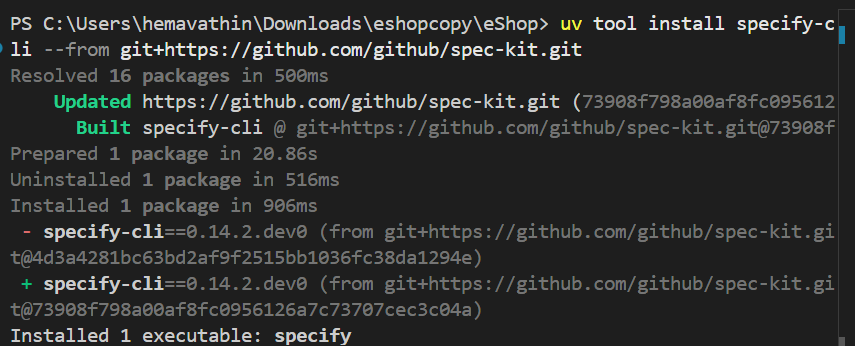
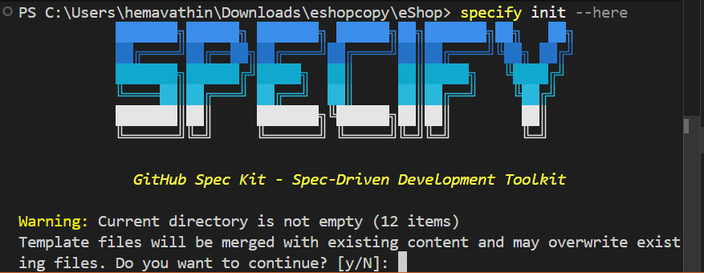
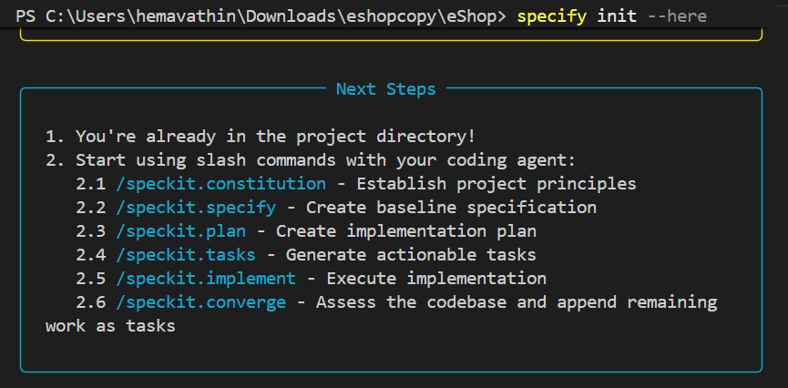
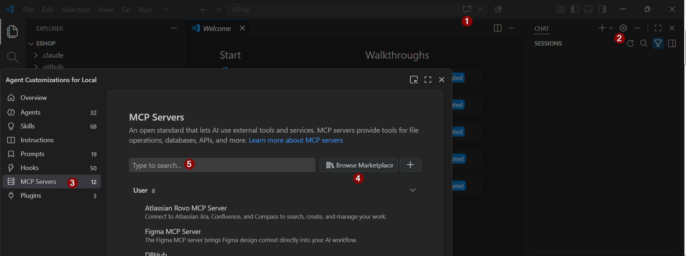
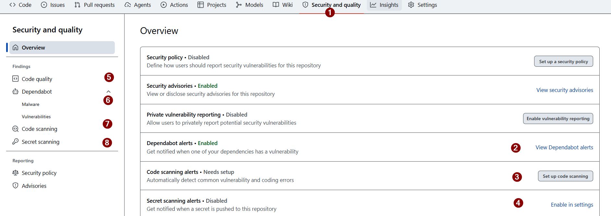

# Exercise 00 — Prerequisites 

> **Duration**: 8 minutes<br>
> **GitHub/Copilot Feature**: -<br>
> **Goal**: Ensure your development environment is ready for the eShop microservices workshop. Verify that .NET SDK, Git, Spec Kit CLI, GitHub Copilot, and GitHub MCP server are installed and configured. 

---

## Background

Before starting the workshop, ensure your development environment is ready: .NET SDK, Git, Spec Kit CLI, GitHub Copilot, and GitHub MCP server configured. A parent issue acts as the single source of truth — all specification artifacts, tasks, and PRs link back to it.

---

## Step 1 — Verify Necessary Installation


In your terminal, verify and install the required tools.

```bash
# Check .NET 8+
dotnet --version

# Check Node.js 18+
node --version

# Check npm 8+
npm --version

# Check Git
git --version

# Check uv
uv --version
```

**Only If `uv` is not installed, Follow these steps:**

```bash
# Windows (PowerShell)
winget install astral-sh.uv

# Windows (PowerShell, bypasses execution policy)
powershell -ExecutionPolicy ByPass -c "irm https://astral.sh/uv/install.ps1 | iex"

# macOS / Linux
curl -LsSf https://astral.sh/uv/install.sh | sh
```

After installation, restart your terminal or add `uv` to your PATH:

```powershell
# PowerShell
$env:Path = "$env:USERPROFILE\.local\bin;$env:Path"
```

```cmd
# CMD
set Path=%USERPROFILE%\.local\bin;%Path%
```

Verify the installation:

```bash
uv --version
```

**After UV installation, install Spec Kit:**

```bash
uv tool install specify-cli --from git+https://github.com/github/spec-kit.git
```


Initialize Spec Kit in the project:

```bash
specify init --here
```


When prompted, type `yes` to initialize in the existing repository, choose GitHub Copilot as the AI Assistant, and PowerShell as the script type and complete the initialization.



## Step 2 — GitHub MCP Enablement


Configure GitHub MCP Server (for `#issue_read` and `sub_issue_write` in later exercises):

1. Open GitHub Copilot Chat **Settings** (`Ctrl+Alt+I`) and go to **Agent Customization**.
2. Select **MCP Server** and browse to **Marketplace → GitHub MCP Server** to install it.



If you don't have the GitHub MCP server installed, use GitHub CLI instead (comes with most Git installations):

```bash
gh version  # Verify GitHub CLI is available
```
Authenticate with GitHub using the CLI:

```bash
# Authenticate with GitHub
gh auth login

# Verify authentication
gh auth status
```

## Step 3 — GitHub Advanced Security and Code Quality Enablement

Enable GitHub Advanced Security features and code quality tools in your repository:

1. **Enable Advanced Security**:
   - Go to your GitHub repository **Security & quality**.
   - Enable **Secret scanning alerts**, **Dependabot alerts**, and **Code Scanning alerts**.



2. **Enable Code Quality**:
   - Go to your GitHub repository **Settings** → **Code quality**.
   Check these options:
   - Show inline suggestions in pull requests
   - Show findings in Security tab
   - Report on dashboard
   Click **Save**
   - This scans for vulnerabilities and quality issues in your codebase and also does code coverage.

---
## Step 4 — Start the eShop Application

### 1. Clone the repository (if you haven't already):

```bash
git clone https://github.com/CanarysResources/eShop.git

```
Go to client directory and create a `.env` file with the following content:

```bash
VITE_API_BASE_URL=http://localhost:5100
```
In a new terminal, install the frontend dependencies:

```bash
cd client
npm install
```
### 2. Start the backend services and frontend

Follow the repository run sequence so the backend services and frontend are started in the right order.

### Option 1 — Use VS Code Run and Debug Extension

Select **Run and Debug** → **MyEcomm-Full Stack** → **Run**.
Ensure that the application starts successfully and is accessible at http://localhost:5173/.

### Option 2 — Use the terminal

Open five separate terminals from the repository root and run one service in each terminal.

Terminal 1 — Catalog Service

```bash
cd src/Services/Catalog/MyEcomm.Catalog.Api
dotnet run
```

Terminal 2 — Cart Service

```bash
cd src/Services/Cart/MyEcomm.Cart.Api
dotnet run
```

Terminal 3 — Identity Service

```bash
cd src/Services/Identity/MyEcomm.Identity.Api
dotnet run
```

Terminal 4 — Order Service

```bash
cd src/Services/Order/MyEcomm.Order.Api
dotnet run
```

Terminal 5 — API Gateway

```bash
cd src/Gateway/MyEcomm.Gateway
dotnet run
```

All five services should be running before you test any end-to-end flow through the gateway.

### 3. Start the frontend

In a new terminal, run the React app:

```bash
npm run dev
```

The frontend should be available at http://localhost:5173/.

---

## Verify

- [ ] Development environment is fully configured
- [ ] GitHub Copilot and MCP server are enabled
- [ ] eShop application starts successfully

---

## Productivity Benefit

> 10 minutes of environment setup now saves hours of blocked-agent frustration later. A configured MCP server alone eliminates manual copy-paste of issue context across every future exercise.

---

**Next**: [Exercise 01 — Constitution: Define eShop Microservices Principles](exercise-01-constitution.md)
