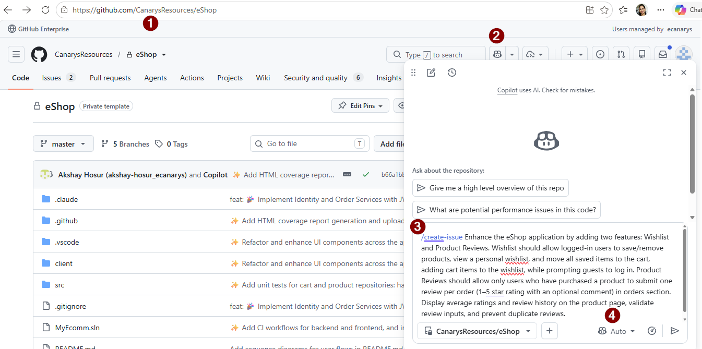
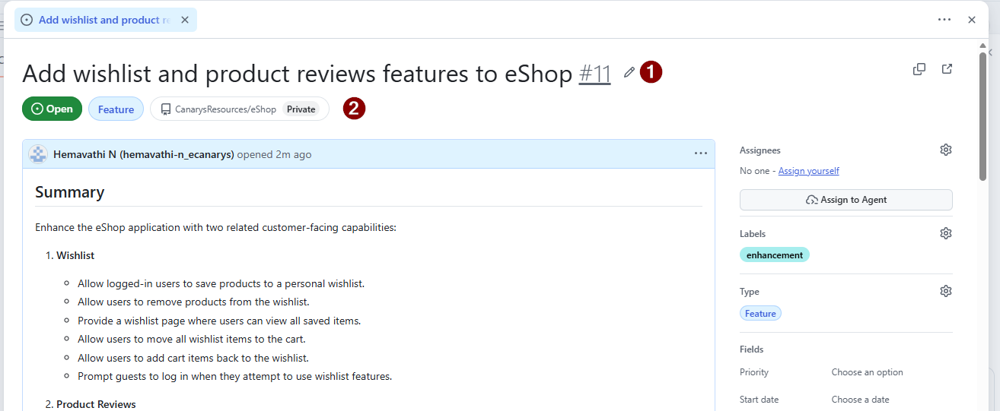
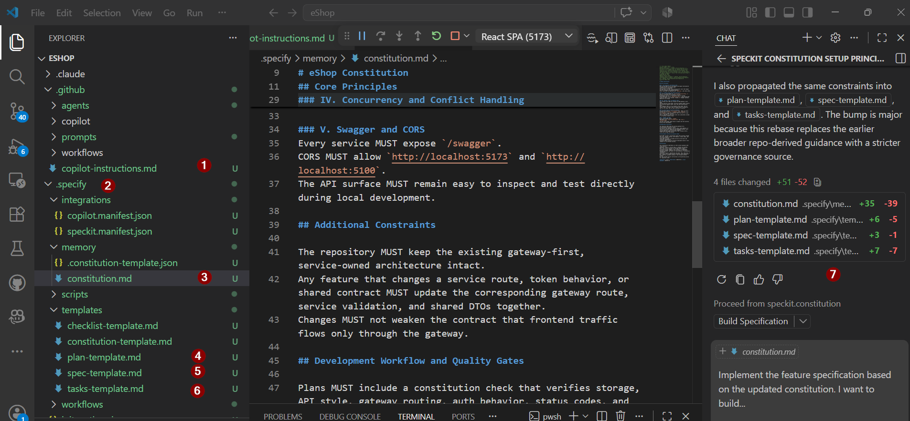

# Exercise 01 — Constitution: Define eShop Microservices Principles

> **Duration**: 8 minutes
> **Copilot Feature**: Spec Kit Constitution
> **Goal**: Establish guiding principles for the eShop microservices architecture that all features will follow.

---

## Background

The **Constitution** defines architectural principles once: Minimal APIs (no Controllers), in-memory storage (ConcurrentDictionary), shared contracts, and JWT auth. Write once; validate all future features against it.

---

## Step 1 — Create Parent GitHub Issue


Go to **github.com** and use **Copilot** **`/create-issue`** followed by prompt

Copy and paste this template:

```
Enhance the eShop application by adding two features: Wishlist and Product Reviews. Wishlist should allow logged-in users to save/remove products, view a personal wishlist, and move all saved items to the cart, adding cart items to the wishlist, while prompting guests to log in. Product Reviews should allow only users who have purchased a product to submit one review per order (1–5 star rating with an optional comment) in orders section. Display average ratings and review history on the product page, validate review inputs, and prevent duplicate reviews.
```


Note the issue number `<ISSUE-NUMBER>` — you will reference it in later exercises.




## Step 2 — Run Spec Kit Constitution

In Copilot Chat (`Ctrl+Alt+I`), paste this minimal constitution prompt:

```
/speckit.constitution setup the base principles based on #file:copilot-instructions.md
```
Copilot instruction file contains the application patterns and rules for eShop microservices. 

> **Tip**: Copilot reads `.github/copilot-instructions.md` and generates a Constitution that references your eShop patterns.
> **Note**: For Speckit Installation, see [exercise-00-prerequisites.md](exercise-00-prerequisites.md).


---

## Step 3 — Verify & Commit

After Copilot completes:

```bash
git add .specify/constitution.md && git commit -m "chore: constitution"
```

---

## Verify

- [ ] `.specify/constitution.md` exists
- [ ] Document covers all core principles (APIs, storage, auth, DTOs, gateway, concurrency, testing)
- [ ] Constitution aligns with the eShop microservices rules
- [ ] Committed to Git

---

## Key Takeaway

> Write the Constitution once; every future feature validates against it. One-time investment prevents rework and architectural drift.

---

**Next**: [Exercise 02 — Specify: Define Wishlist + Reviews Requirements](exercise-02-specify.md)
