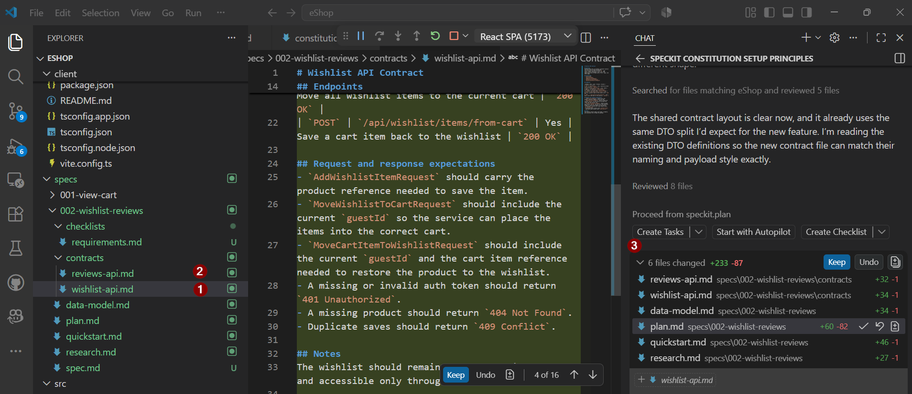

# Exercise 03 — Plan: Design the Technical Architecture

> **Duration**: 8 minutes
> **Copilot Feature**: Spec Kit Plan
> **Goal**: Translate the specification into a concrete technical design: API contracts, data models, service boundaries, and integration flows.

---

## Background

The **Plan** transforms the spec into concrete architecture: Service Boundaries, API Endpoints, Data Models, Integration Flows, Error Handling, and Concurrency Strategy.

---

## Step 1 — Run Spec Kit Plan

In Copilot Chat, paste this concise plan prompt:

```
/speckit.plan Wishlist: nav link in header alongside cart (fk-cart-btn style), save-to-wishlist action in cart item row next to REMOVE, wishlist page mirrors catalog grid. Reviews: rating badge + review list on product detail page below description; review submission form on orders page per order item.


```

> **Tip**: Copilot references Constitution and Spec to generate an aligned plan.



---

## Step 2 — Review & Commit

Once Copilot completes, open `.specs/001-add-wishlist-reviews/plan.md`:

- Service boundaries clear
- All endpoints listed (HTTP verbs, paths, request/response)
- Data models minimal and clear
- Integration flows documented
- Error handling covers all status codes
- Concurrency strategy explicit

Commit:

```bash
git add .specs/001-add-wishlist-reviews/plan.md && git commit -m "spec: plan"
```

---

## Verify

- [ ] `.specs/001-add-wishlist-reviews/plan.md` exists
- [ ] Endpoint and integration flow for UserProfile and Reviews is clear
- [ ] Status codes 201/200/204/400/404/401/409 are defined
- [ ] ConcurrentDictionary concurrency handling is explicit

---

## Key Takeaway

> Plan is the blueprint. Developers should be able to start coding from the endpoint list and data models.

---

**Next**: [Exercise 04 — Tasks: Break into Implementation Work Items](exercise-04-tasks.md)
