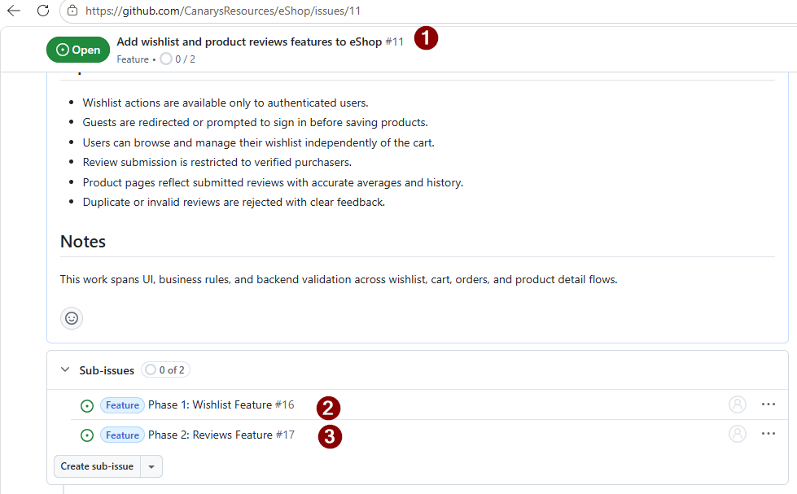

# Exercise 04 — Tasks and Sub-Issues: Break into Implementation Work Items

> **Duration**: 10 minutes<br>
> **GitHub/Copilot Feature**: Spec Kit Tasks, GitHub MCP Sub-Issues<br>
> **Goal**: Decompose the plan into ordered tasks, create GitHub sub-issues, and preserve traceability for implementation.

---

## Background

The **Tasks** phase breaks the plan into 2 focused phases: (1) Complete Wishlist feature, (2) Complete Reviews feature. Once the task list is stable, each item is promoted to a GitHub sub-issue so implementation work stays traceable back to the parent issue.

---


## Step 1 — Run Spec Kit Tasks (2 Phases Only)

Paste this focused tasks prompt:

```
/speckit.tasks 2 phases only

Complete Wishlist Feature — wishlist is accessible from header nav and CartItemRow only; do NOT add anything wishlist-related to ProductDetailPage
Complete Reviews Feature


```

---

## Step 3 — Convert Tasks into GitHub Sub-Issues

Use the task list to create sub-issues linked to the parent issue from Exercise 01.

```text
Refer #file:tasks.md and Use GitHub MCP #sub_issue_write to create detailed sub-issue per phase to the parent issue number <ISSUE-NUMBER>
```

> **Tip**: If the MCP tool is unavailable, create the sub-issues manually.



> **Optional**: Use [Jira Alternative Workflow](jira-alternative-workflow.md) if your team prefers Jira.


## Step 4 — Create Branch and raise PR

```bash
git checkout -b feature/wishlist-reviews
git push -u origin feature/wishlist-reviews
```

Create a pull request on GitHub from the `feature/wishlist-reviews` branch.


---

## Verify

- [ ] Tasks are decomposed and documented
- [ ] Sub-issues are created for each phase
- [ ] PR is created for feature branch


---

## Productivity Benefit

> Task decomposition + GitHub sub-issues converts a vague feature into a tracked, assignable work queue in minutes. Every task links back to the spec, so review cycles shrink because reviewers can see intent alongside code.

---

**Next**: [Exercise 05 — Wishlist Implementation with Copilot Coding Agent](exercise-05-wishlist-coding-agent.md)
