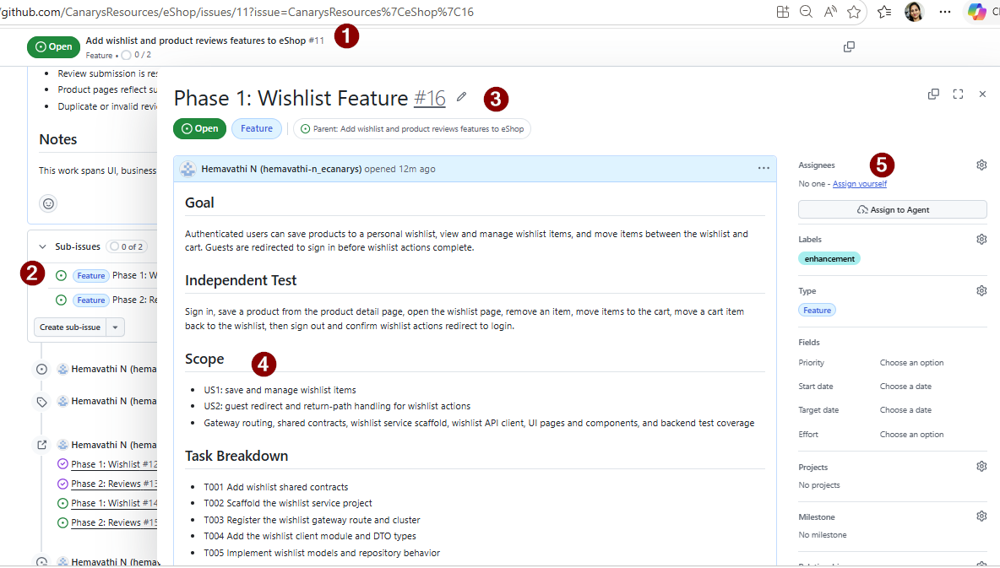
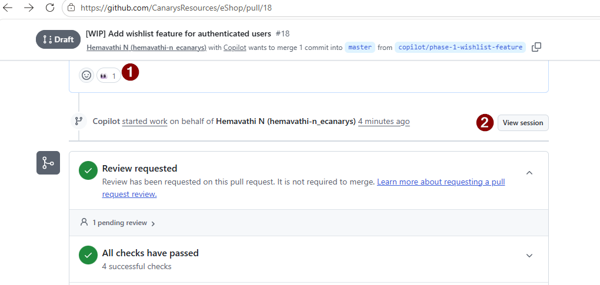
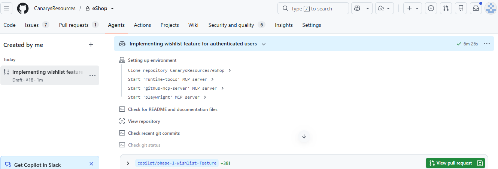
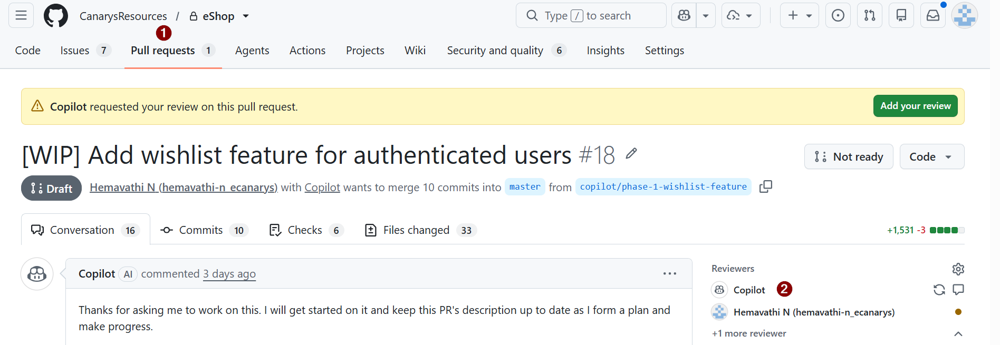

# Exercise 05 — Wishlist Implementation with Copilot Coding Agent

> **Duration**: 10 minutes
> **Copilot Feature**: Copilot Coding Agent, Issue Assignment
> **Goal**: Assign Wishlist (straightforward CRUD) to coding agent and observe clean, pattern-consistent code generation.

---

## Background

The Copilot coding agent excels at CRUD: it reads `.github/copilot-instructions.md` for eShop patterns and produces production-ready boilerplate. Wishlist is ideal: add/remove/view. No complex business logic — just clean endpoints.

---

## Step 1 — Read GitHub SubIssue for Wishlist

Go to **Issues**  → **Sub issue** - select the sub-issue for Wishlist as context to the coding agent. 

```markdown
# Goal: Implement Wishlist feature

## Scope:
- Add/Remove products to wishlist
- View personal wishlist

## Tasks:
- Implement Wishlist endpoints in UserProfile.Api
- Implement Wishlist DTOs

```

Note the issue number `<ISSUE-NUMBER>` (e.g., #XX).

---
## Step 2 — Assign to GitHub Copilot Coding Agent
 
### **Option 1: GitHub.com → Assign to Copilot Coding Agent** (Preferred option for this exercise)
- Assignees dropdown → "Assign to agent"
- Select Copilot Coding Agent
- **Default model** automatically selected
- **Select model** dropdown → choose your preferred model and add additional prompt if required.



 
### **Option 2: GitHub.com → Click Copilot Icon & Select Model**
- Click Copilot icon (🤖) under sub-issue
- Select your preferred model in modal
- Type prompt: `Implement issue #<issue_number>: Wishlist Feature`

 
### **Option 3: VS Code → Copilot Chat with Cloud Agent**
- Open Copilot Chat in VS Code (`Ctrl+Shift+I`)
- Select Cloud Agent from dropdown
- Type prompt: `Implement issue #<issue_number>: Wishlist Feature`

 
---
## Step 3 — Implement Wishlist Feature

Copilot coding agent generates code for Wishlist endpoints and DTOs. Complete details can be seen in the PR created by the agent in `View Session`. Click on `View Session` to see the PR with all generated code.




---
## Step 4 — @Copilot for any Modifications
- If you need to modify the generated code, you can @mention Copilot in the PR followed by your request. 

For example

```
@copilot run and show the UI functionality of wishlist feature
```

---
## Step 5 — Request Review from Copilot Review Agent

- Navigate to the PR created in Step 2
- Scroll to right sidebar → Find **Reviewers** section
- Click **"Request review from Copilot"**
- Copilot Review Agent reviews code


---
## Verify

- [ ] Issue assigned to Copilot
- [ ] PR created for the implementation
- [ ] UserProfile.Api CRUD and wishlist UI are implemented
- [ ] Copilot Review Agent feedback received

---

## Key Takeaway

> Default agent produces clean CRUD code with self-review before human review..

---

**Next**: [Exercise 06 — Product Reviews Implementation with Local Agent](exercise-06-reviews-local-agent.md)
