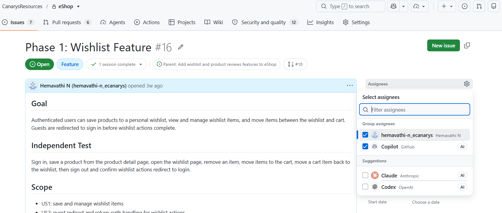
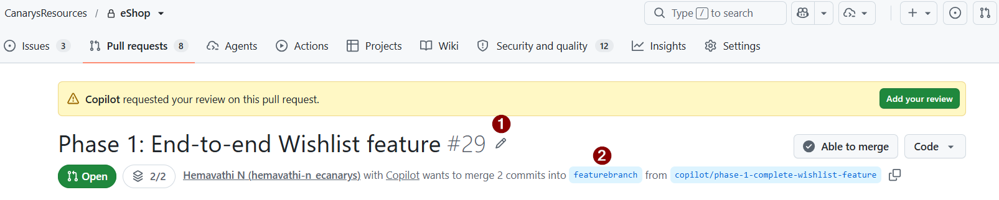
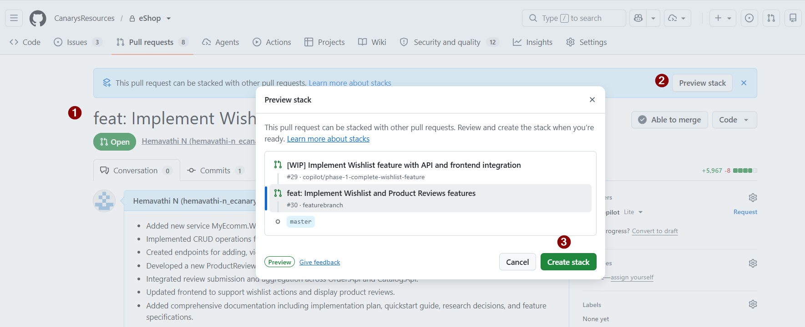

# Exercise 05 — Wishlist Implementation with Copilot Coding Agent

> **Duration**: 10 minutes<br>
> **GitHub/Copilot Feature**: Copilot Coding Agent, Issue Assignment, Code Review<br>
> **Goal**: Assign Wishlist (straightforward CRUD) to coding agent and observe clean, pattern-consistent code generation.

---

## Background

The Copilot coding agent excels at CRUD: it reads `.github/copilot-instructions.md` for eShop patterns and produces production-ready boilerplate. Wishlist is ideal: add/remove/view. No complex business logic — just clean endpoints.

---

## Step 1 — Read GitHub SubIssue for Wishlist

Go to **Issues**  → **Sub issue** - select the sub-issue for Wishlist as context to the coding agent. 

```markdown
# Goal: Implement Wishlist feature

## Scope:
- Add/Remove products to wishlist
- View personal wishlist

## Tasks:
- Implement Wishlist endpoints in UserProfile.Api
- Implement Wishlist DTOs

```

Note the issue number `<ISSUE-NUMBER>` (e.g., #XX).

---
## Step 2 — Assign to GitHub Copilot Coding Agent
 
### **Option 1: GitHub.com → Assign to Copilot Coding Agent** (Preferred option for this exercise)
- Assignees dropdown → "Assign to agent"
- Select Copilot Coding Agent
- **Default model** automatically selected
- **Select model** dropdown → choose your preferred model and add additional prompt if required.


### **Option 2: Assign to Multiple Agents (Optional)**
- Click Assignees → **Settings**
- Select **Copilot Coding Agent** (primary)
- In **Suggestions** field, enable:
  - **Claude** 
  - **Codex** 
- Each agent runs independently and provides feedback in PR thread
- **When to use**: Complex features requiring multi-perspective validation




> **Note**: To use third-party agents, you must enable them in **Organization Settings → Code, planning and automation → Copilot → Cloud Agents** and enable partner agents. See [Copilot Cloud Agent Settings](https://docs.github.com/en/enterprise-cloud@latest/copilot/how-tos/administer-copilot/manage-for-organization/manage-policies) for details.

### **Option 3: VS Code → Copilot Chat with Cloud Agent**
- Open Copilot Chat in VS Code (`Ctrl+Shift+I`)
- Select Cloud Agent from dropdown
- Type prompt: `Implement issue #<issue_number>: Wishlist Feature`
---
## Step 3 — Implement Wishlist Feature

Copilot coding agent generates code for Wishlist endpoints and DTOs. Complete details can be seen in the PR created by the agent in `View Session`. Click on `View Session` to see the PR with all generated code.


---
## Step 4 — @Copilot for any Modifications (Optional)
- If you need to modify the generated code, you can @mention Copilot in the PR followed by your request. 

For example

```
@copilot Write Playwright e2e tests that verify the wishlist add/remove/view flows and add a GitHub Actions workflow to run them on PR.
```

---
## Step 5 — Request Review from Copilot Review Agent

- Navigate to the PR created in Step 2
- Scroll to right sidebar → Find **Reviewers** section
- Click **"Request review from Copilot"**
- Copilot Review Agent reviews code


---
## Step 6 — Enable Automatic Copilot Code Review (Optional)

To automatically request Copilot Review on every PR:

- Go to **Repository Settings → Code,planning and automation**
- Under **Ruleset**, create **New branch ruleset** (or **Automatic code review**)
- In branch rules enable **Automatically request Copilot code review** to ON
- (Optional) Configure review scope:
   - new pushes
   - draft PR
- Save settings

> **Note**: Reference link for [Configuring automatic code review by GitHub Copilot — GitHub Docs](https://docs.github.com/en/enterprise-cloud@latest/copilot/how-tos/copilot-on-github/set-up-copilot/configure-automatic-review)

---

## Step 7 — Stacked PR

Copilot coding agent creates a PR for the Wishlist feature. Lets merge the PR with feature/wishlist-reviews branch. 



Use Stacked PR strategy to merge the PR into main branch. This allows you to merge the PR without losing the feature/wishlist-reviews branch. Refer to [Stacked PRs](https://docs.github.com/en/pull-requests/how-tos/stacked-pull-requests) for more details.



---

## Step 8 — Update VS Code Launch Config After Merge

After merging and pulling locally, prompt the local agent in Copilot Chat:

```
Update .vscode/launch.json and .vscode/tasks.json so the Wishlist service is included in Run and Debug, preserving existing configs.
```

Then restart **Run & Debug → MyEcomm-Full Stack**.
---

## Verify

- [ ] Issue assigned to coding agent
- [ ] Implementation PR is created
- [ ] Code review feedback is incorporated

---

## Productivity Benefit

> A well-specified issue assigned to the Coding Agent produces a complete PR — endpoints, DTOs, tests — while you work on something else. Boilerplate that would take a developer 2–3 hours is ready for review in minutes.

---

**Next**: [Exercise 06 — Product Reviews Implementation with Local Agent](exercise-06-reviews-local-agent.md)
