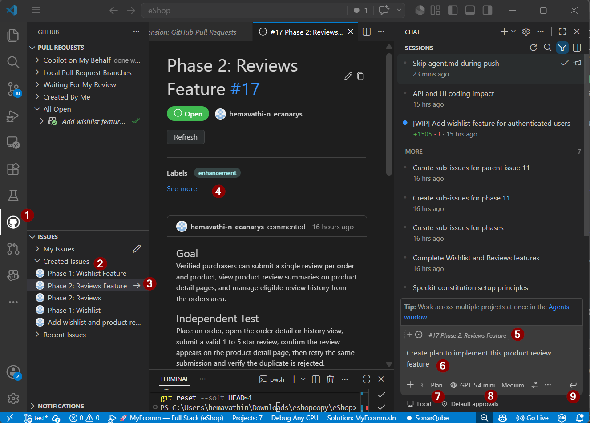
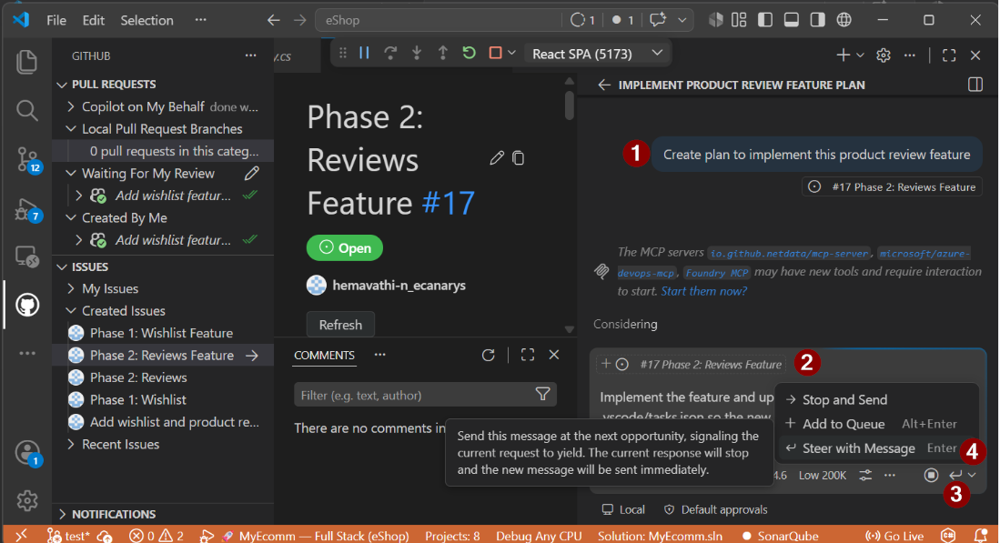
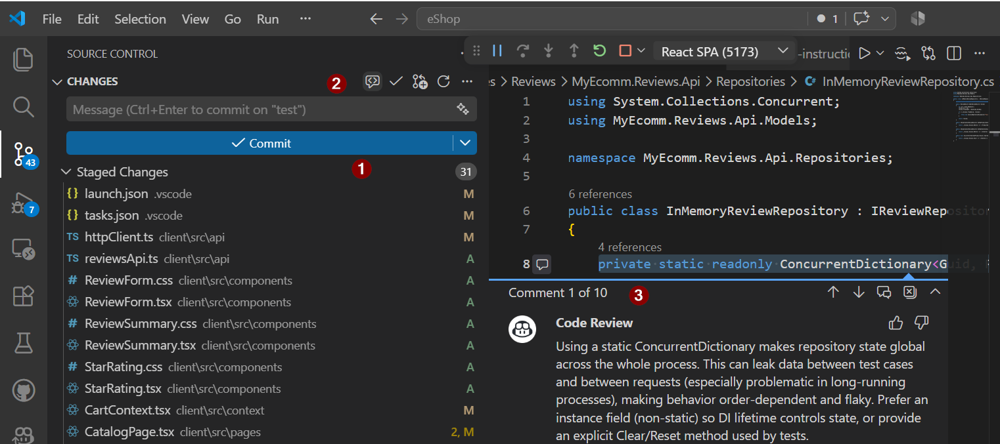
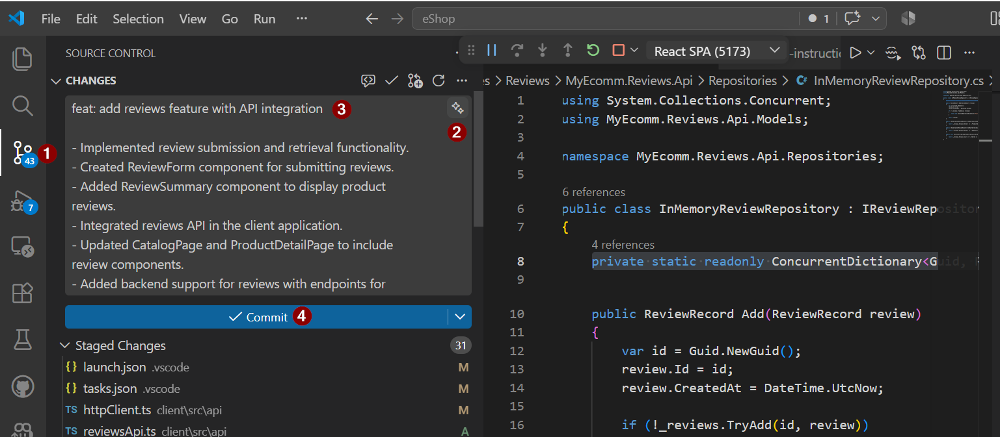
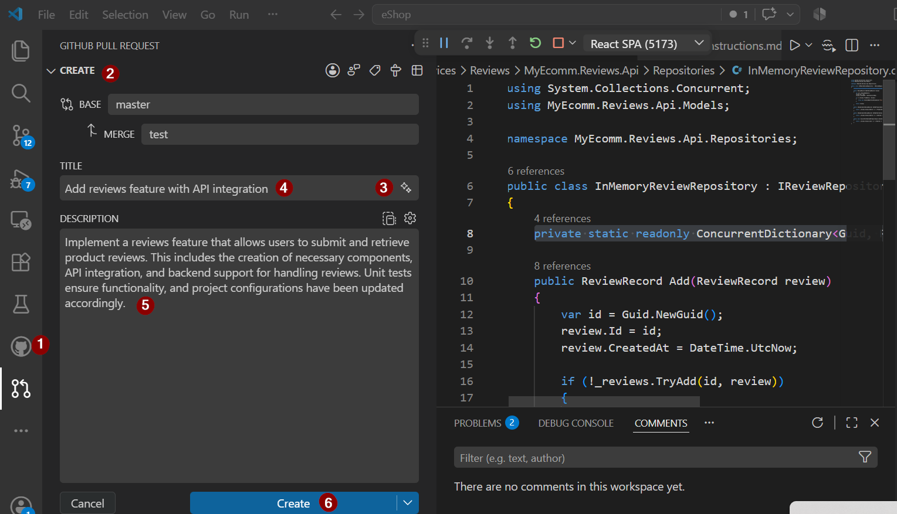

# Exercise 06 — Product Reviews Implementation with Local Agent

> **Duration**: 10 minutes<br>
> **GitHub/Copilot Feature**: Local Agent Assignment, GitHub Extension Issue, Code Review<br>
> **Goal**: Assign Reviews (with purchase verification and rating aggregation) to the GitHub Copilot local agent and observe domain-focused code.

---

## Background

Reviews require complex business logic: verify user purchased product, aggregate ratings safely, prevent duplicates. By assigning to the **GitHub Copilot local agent**, Copilot prioritizes verification, validation, and concurrency — not just boilerplate.

---
## Step 1 — Create Product Review feature branch

Open **Source Control** (Ctrl+Shift+G or left sidebar). Click **Create Branch** from feature/wishlist-reviews and name it `feature/ProductReviews`

## Step 2 — Read GitHub Issue for Product Reviews from GitHub Extension

Go to **Issues** → **Created Issues** → select the sub-issue for **Product Reviews** as **context** to the local agent

---

## Step 3 — Assign to GitHub Copilot Local Planning Agent and Assign to GitHub Copilot Local Agent

From Copilot chat, use the GitHub Copilot local `**plan agent**` and implement the feature with this main prompt:

```
Create plan to implement this product review feature
```



Add this follow-up prompt to steer the agent with the message feature:

```
Implement the feature and update .vscode/launch.json and .vscode/tasks.json so the new service/app can be built and launched from VS Code, while preserving existing configs.
```


Wait 2–3 min for plan , review and make changes if any

Verify plan emphasizes:
   - Order Service verification call
   - Concurrency handling (atomic ConcurrentDictionary)
   - Integration test for verification

Assign to `**local agent**` to implement using Implement Handoff `**Start Implementation**` button.

---

## Step 4 — Review Changes with Copilot
 
**Click on Source Control** (Ctrl+Shift+G or left sidebar) **Hover on "Changes"** section **Click on "Code Review Uncommitted Changes"** to review the generated code


---
## Step 5 - Commit message with Copilot

**Click on Source Control** (Ctrl+Shift+G or left sidebar) **Hover on "Changes"** section **Click on "Generate Commit Message"** to generate a commit message


---
## Step 6 - Github Pull Request 

**Click on Github Extension**, **Click on "Create Pull Request"** to create a pull request for the changes made by the local agent. Click **Generate with Copilot** to generate a pull request Title and description automatically with copilot and create PR




## Verify

- [ ] Issue assigned to local agent
- [ ] Implementation is completed and tested
- [ ] PR is created and reviewed

---

## Productivity Benefit

> The local agent handles the hard parts — purchase verification, concurrency-safe aggregation, duplicate prevention — in the same time it would take a developer to just scaffold the project. Complex domain logic goes from hours to a review cycle.

---

**Next**: [Exercise 07 — Code Quality](exercise-07-code-quality.md)
