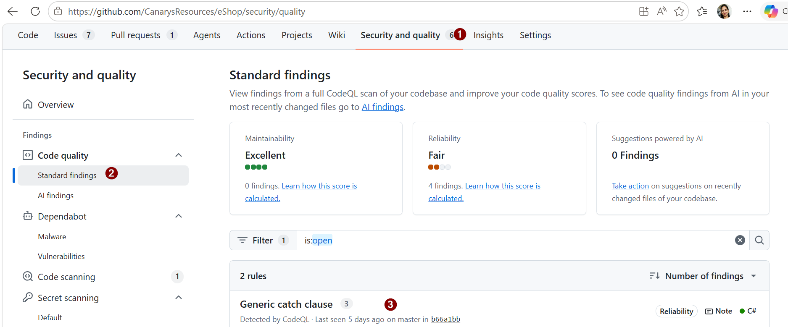
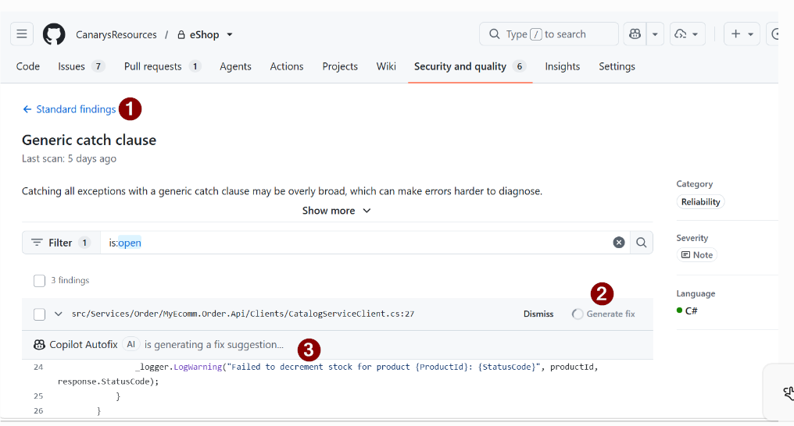

# Exercise 07 — Enable Code Quality, Create PR and Fix Code Quality Issues

> **Duration**: 8 minutes  
> **Copilot Feature**: Code Quality, PR Copilot  
> **Goal**: Enable repository Code Quality scanning and create your first quality-checked PR from VS Code.

---

## Background

Code Quality scans your codebase for bugs, security issues, and violations. This exercise sets up automated scanning and validates a PR against quality standards.

---
 
## Step 1 — Enable Code Quality
 
1. Go to **Repository → Settings → Security and Quality → Code Quality**
2. Click the **Enable Code Quality** toggle

>**Note**: If you do not see the Code Quality tab, refer to [exercise-00-prerequisites.md](exercise-00-prerequisites.md) for setup instructions.
 
---
 
 
## Step 2 — Create PR for Review Feature from VS Code
 
**Create PR from GitHub extension**
- Click **GitHub** extension icon on left sidebar
- Click **Create Pull Request** button
- VS Code opens PR creation dialog
 
**Generate title with Copilot**
- Click the **Copilot** icon in PR title field
- Copilot auto-generates title for review feature
- Accept or edit the title
 
**Add description and create PR**
- Add PR description (scope, changes, testing)
- Review the details
- Click **Create** button
- Verify PR created in GitHub

 
---
 
## Step 3 — Review Findings & Generate Fix for Code Quality Issues
 
**Access Security and Quality tab on GitHub**
- Go to **github.com**
- Click on **Security and quality** tab
- Click on **Code Quality**
- Review standard findings (bugs, issues, violations)

---
## Step 4 — Generate fix for an issue
- Click on one of the findings listed
- Review the issue description and code snippet
- Click **Generate fix** button
- Copilot auto-fix modal appears
- Review the suggested fix
- Click **Accept** to apply Copilot-generated fix
- Commit is added to the PR automatically

---
 
## Step 5 — Verify fix in Actions
- Go to **Actions** tab
- Wait for build to re-run with the fix
- Verify build passes (green ✓)

---

> **Tip**: The backend pipeline is the one that should produce the coverage artifact.

---

## Verify

- [ ] Code Quality enabled
- [ ] PR created successfully
- [ ] Fixes applied for Code Quality issues
- [ ] Build passes in Actions 

---

## Key Takeaway

> Code Quality scans catch bugs, security issues, and violations early. Copilot can assist in generating fixes for Code Quality issues.

---

**Next**: [Exercise 08 — View the Coverage Report Artifact](exercise-08-coverage-report-artifact.md)

 

 

 
