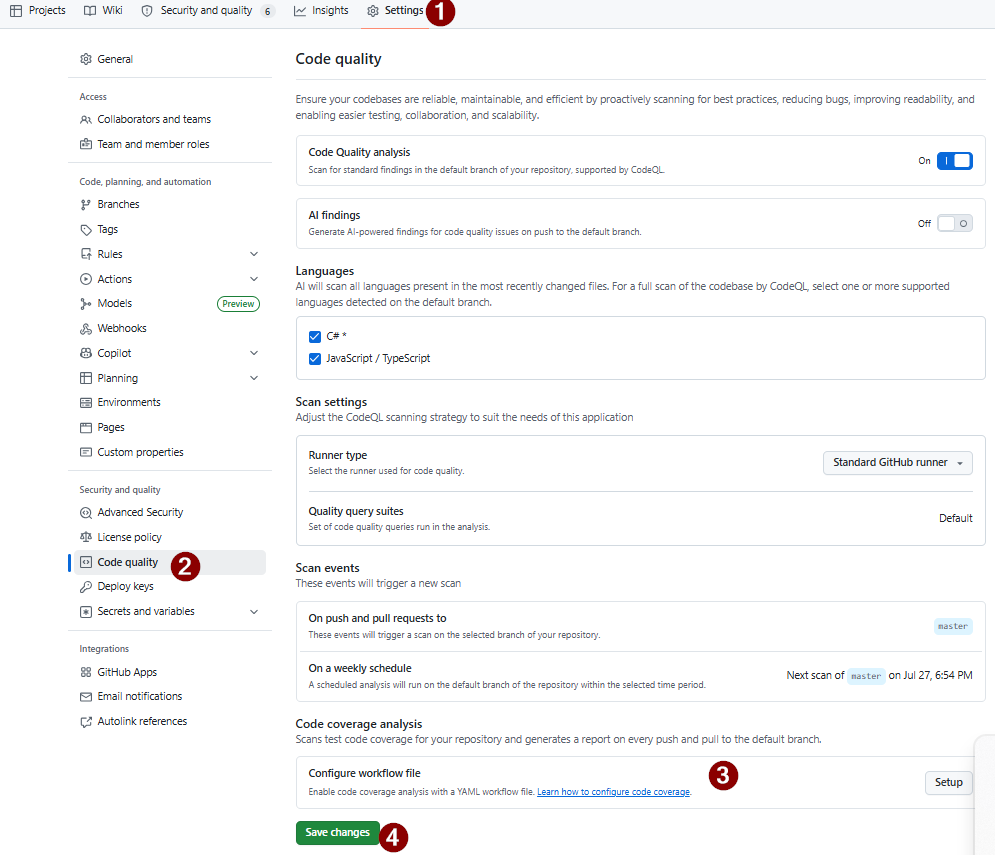
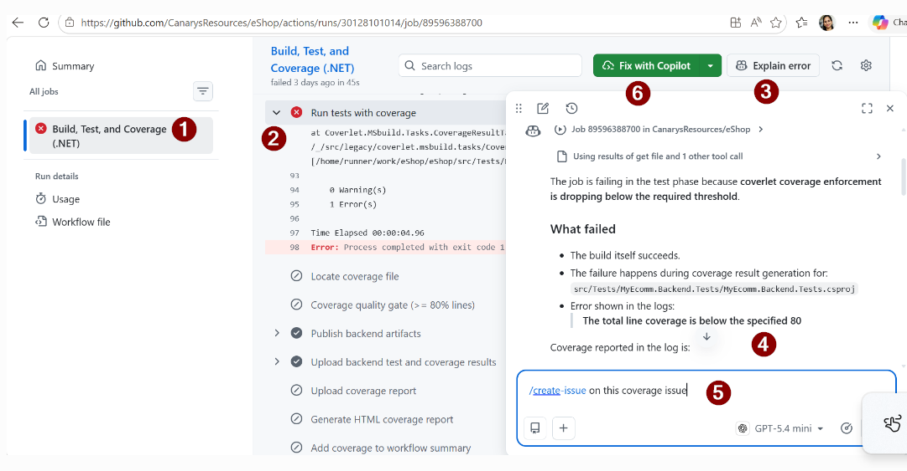
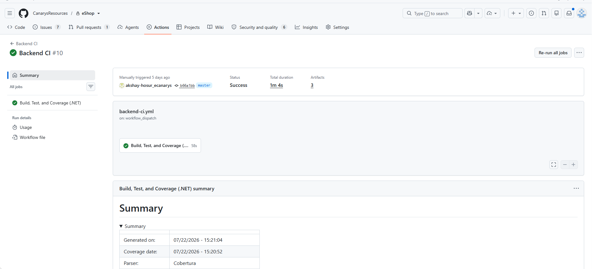
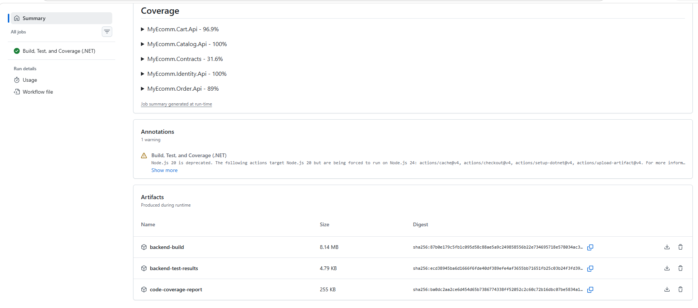

# Exercise 08 — View the Coverage Report Artifact

**Duration**: 6 minutes
**Copilot Feature**: GitHub Actions, CI Pipeline Review
**Goal**: View the coverage report artifact generated by the backend CI pipeline, diagnose a build failure, and create an issue for the coding agent to fix it.

---

## Background

Build failures block merging. This exercise teaches two approaches: **auto-fix for quick repairs** and **issue creation for complex fixes**.

---

## Step 1 — Configure Code Coverage Analysis
 
**Access Code Quality settings**
- Go to Repository → Settings → Code security and analysis
- Click **Code Quality**
 
**Select workflow files**
- Click **Configure** under Code coverage analysis
- Backend CI Coverage → Select `.github/workflows/backend-ci.yml`
- Frontend CI Coverage → Select `.github/workflows/frontend-ci.yml`
 
**Enable coverage options**
- Show coverage in pull requests
- Show coverage badge
- Fail PR if coverage drops
 
**Save configuration**
- Click **Save**
- Verify "Code coverage configuration saved" confirmation


---
## Step 2 — Verify Workflow Configuration
 
**Check coverage threshold**
- Go to Repository → `.github/workflows/backend-ci.yml`
- Find "Run tests with coverage" section
- Verify 80% minimum enforced:
  - `/p:Threshold=80` (80% minimum)
  - `/p:ThresholdType=line` (line coverage)
  - `/p:ThresholdStat=total` (whole project)
  
 
**Confirm quality gates**
- Verify "Coverage quality gate" step enforces 80% on PRs
- Verify "Upload backend test" uploads logs & coverage XML
- Verify "Generate HTML coverage report" creates artifact
 
 
---
 
## Step 3 — Diagnose Build Failure
 
- Go to your **Actions** tab
- Click the failed build run
- Expand logs to find error details


 
**Identify error type**
- Test failures (test assertion errors)
- Compilation errors (syntax or missing dependencies)
- Missing implementations (incomplete methods/services)
- Note all relevant error messages
 
---
 
 
## Step 4 — Create Issue for Coding Agent
 
**Open Copilot in PR**
- Click **Copilot** icon
- Select **Immersive Mode**
- Type: `/create-issue`
 
**Fill issue details**
- Title: `Fix: Resolve build failure in [feature name]`
- Description: Include error logs and context
- Assignee: Coding Agent
 
**Set issue labels**
- Label: `type:bug`
- Label: `priority:high`
- Click **Create**
 
**Coding agent handles fix**
- Agent investigates the issue
- Agent creates linked PR with fixes
- Agent adds tests automatically
- Agent submits for review
 
**Verify and merge**
- Wait for linked PR creation
- Review agent's changes
- Merge when ready
 
---
 
## Step 5 — Build and View Coverage Report Artifact
 
- Go to **Actions** tab
- Click the successful build run
- Expand **Artifacts** section
- Click **code-coverage-report** to download
- Extract the ZIP file




---

## Step 6 — (Optional) Use Copilot CLI to Analyze & Fix Coverage Gaps

When build fails with **coverage threshold errors**, use the Copilot CLI workflow to analyze and auto-fix.

### Workflow File
Location: `.github/workflows/copilot-cli-coverage-fixer.yml`

### How to Trigger (3 Modes)

**Via GitHub UI:**
- Go to **Actions** → **Copilot CLI - Fix Coverage Gaps**
- Click **"Run workflow"**
- Set mode and click **"Run workflow"**

**GitHub CLI**:
```bash
# Analyze only
gh workflow run copilot-cli-coverage-fixer.yml -f fix_mode=analyze-only

# Preview test stubs
gh workflow run copilot-cli-coverage-fixer.yml -f fix_mode=auto-generate-tests

# Auto-commit fixes
gh workflow run copilot-cli-coverage-fixer.yml -f fix_mode=commit-fixes
```

---

## Verify

- [ ] Code coverage configuration saved
- [ ] Build failure diagnosed and issue created
- [ ] Coding agent created PR with fixes
- [ ] Coverage report artifact downloaded and extracted


---

## Key Takeaway

> Code coverage artifacts provide a detailed view of test coverage, helping teams identify untested code and maintain high-quality standards.

---

**Next**: [Exercise 09 — Enable GHAS + Fix Code Scanning](exercise-09-ghas-code-scanning.md)