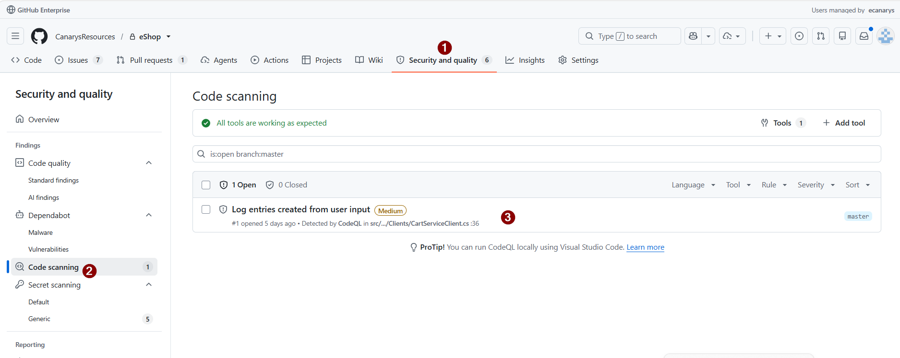
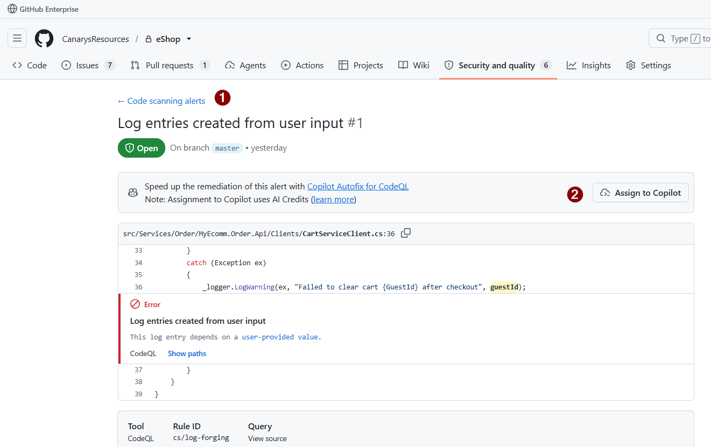

# Exercise 09 — Enable GHAS + Fix Code Scanning

> **Duration**: 8 minutes
> **Copilot Feature**: GitHub Advanced Security, Code Scanning
> **Goal**: Enable code scanning, inspect the alert, use Copilot Autofix, and commit the fix to a new branch without changing checkout behavior.

---

## Background

Code scanning catches risky data flow before it ships. In this repo, the alert is already visible on the Order API client and points to user input reaching an unsafe sink. The goal is to keep the working cart flow intact while removing the vulnerability.

---

## Step 1 — Enable Code Scanning

Open **Security and quality** → **Code scanning** and enable code scanning for the repository.


> **Note**: Enable the scanner first, then open the alert so the rest of the flow is visible end-to-end. Refer to [exercise-00-prerequisites.md](exercise-00-prerequisites.md) for setup instructions if you do not see the alert.

---

## Step 2 — Inspect the Vulnerability

Open the CodeQL alert and read the data flow that reaches the unsafe sink.

```text
Inspect the open CodeQL alert for Log entries created from user input.
```

> **Tip**: Focus on the exact sink, not the full service.


---

## Step 3 — Run Copilot Autofix

Use Copilot Autofix for CodeQL, then choose the option to commit the fix in a new branch.


> **Tip**: The Autofix flow should offer a commit in a new branch; that is the expected workshop outcome.

---

## Step 4 — Commit the Fix

Review the generated diff, commit the new branch, and confirm the alert is closed or moved to a fixed state.


---

## Verify

- [ ] Code scanning alert is resolved or marked fixed
- [ ] No shell/process call remains in the client
- [ ] Order API and cart checkout behavior still work
- [ ] Fix is committed in a new branch

---

## Key Takeaway

> Fix the sink, not the feature: remove the unsafe flow while preserving the working path.

---

**Next**: [Exercise 10 — Remediate Dependency Scanning Findings](exercise-10-ghas-dependency-scanning.md)