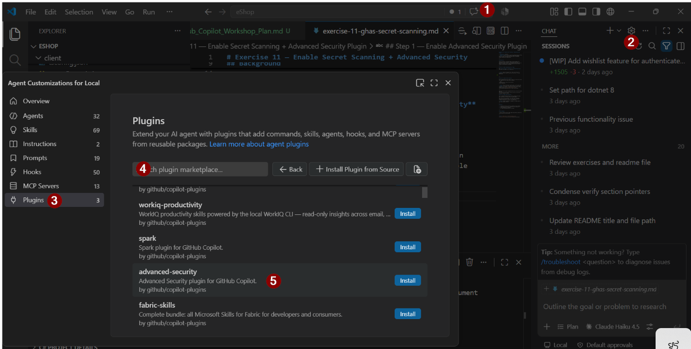
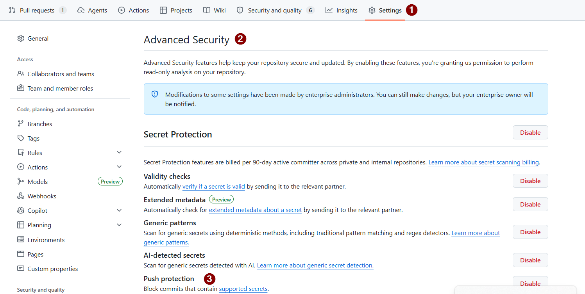

# Exercise 11 — Enable Secret Scanning + Advanced Security Plugin

> **Duration**: 8 minutes<br>
> **GitHub/Copilot Feature**: Secret Scanning, Advanced Security Plugin<br>
> **Goal**: Turn on secret scanning, enable the Advanced Security plugin, and replace the fake secret placeholder without affecting the application.

---

## Background

Secret scanning is the GHAS signal in this workshop. The repository already contains a token-shaped placeholder so participants can see what secret detection looks like once the feature is enabled. The fix should remove the secret while leaving the app behavior unchanged.

---

## Step 1 — Enable Advanced Security Plugin

Open **Chat Settings** → **Plugins** → **Advanced Security** and enable the plugin for the repository.


> **Tip**: Enable the plugin first, then use the built-in prompt to scan the repo so the rest of the flow is visible end-to-end.



---

## Step 2 — Inspect Secret Scanning

Run the Advanced Security prompt to scan for secrets and review the suggested fixes inside secret scanning.

```text
/advanced-security check for any secrets
in the repository 
```

> **Tip**: Focus on the exact secret value, not the whole app.
> **Note**: This plugin uses GitHub MCP server to scan the repository for secrets. If you do not see the secret scanning finding, refer to [exercise-00-prerequisites.md](exercise-00-prerequisites.md) for setup instructions. 

---

Advanced Security plugin suggested the fixes, but do not accept them yet.
Let's observe GitHub Advanced Security result so the secret scanning finding is visible.

## Step 3 — Enable Push Protection

Turn on GitHub Advanced Security secret scanning and enable push protection so secrets cannot be pushed again.

With push protection enabled, any future push containing secrets will be blocked. This is a safety net to prevent accidental exposure of secrets in the repository.

> **Tip**: If push protection is enabled, it should block a push that contains secrets.

---

## Verify

- [ ] Advanced Security tooling is enabled
- [ ] Secret scanning is active
- [ ] Push protection is enabled

---

## Productivity Benefit

> A leaked secret can cost days of credential rotation, incident reporting, and trust recovery. Push protection stops it at the source — zero developer overhead once enabled, and the Advanced Security plugin gives Copilot Chat instant visibility into any existing exposure.

---

**Next**: [Exercise 12 — Run UI Automation with UIAutomationTester](exercise-12-ui-automation-testing.md)