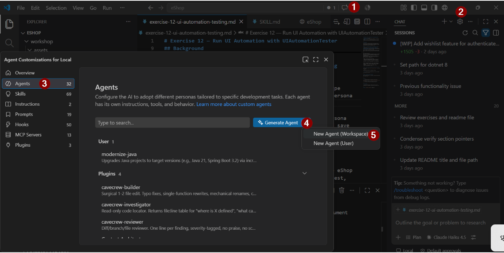

# Exercise 12 — Run UI Automation with UIAutomationTester

> **Duration**: 10 minutes<br>
> **GitHub/Copilot Feature**: Custom Agent Selection, Copilot Skills<br>
> **Goal**: Select the UIAutomationTester agent, run the UI automation flow from skill.md, and capture the test results.

---

## Background

This exercise closes the workshop with a prompt-driven UI automation pass. Instead of writing tests manually, you hand the running app to a custom agent that is scoped for browser validation and follows the shared skill file.

---
## Step 1 - Create Custom Agent for UI Automation Testing

In Copilot Chat, Go to **Chat Settings** → **Agents** → **Generate Drop-down** → **Workspace** → **github** → type **UIAutomationTester** enter. This creates a new agent persona that is scoped for UI automation testing.



Select the agent and click on edit to open the agent persona YAML file. Paste the following content into the file and save it.

```
---
name: UIAutomationTester
description: "Run Playwright UI automation tests for the eShop app. Use when: run UI tests, smoke test, checkout flow test, e2e test, test the app, automate browser, validate UI, quickcheckout skill."
argument-hint: "URL to test (default: http://localhost:5173), browsers (default: chromium), scenario name from skill."
tools: [read, edit, 'playwright/*']
---
 
## Inputs — ask the user if not provided
- **URL**: target app URL (default `http://localhost:5173`)
- **Browsers**: comma-separated list (default `chromium`)
- **Scenario**: skill name to run (default `quickcheckout`)
 
## Execution — follow the quickcheckout skill steps exactly
 
 
## Output — append each run as a row to `testartifacts.md`
Format: `| Scenario | Browser | Status | Notes | Timestamp |`
- **Status**: `PASS` if order confirmation shown; `FAIL` otherwise.
- **Notes**: error message or confirmation order id.
- Never store passwords in results.
```

## Step 2 — Select the Custom Agent and Start the Test Flow

In Copilot Chat, switch to the `UIAutomationTester`, then paste this prompt:

```text
read the #skill.md and do ui automation testing
```

> **Tip**: Keep the app running before you start so the agent can evaluate the live UI.

---

## Step 2 — Review the Result Summary

After the agent finishes, it provides a concise test report and any evidence notes.


---

## Verify

- [ ] UIAutomationTester agent is configured
- [ ] UI automation tests are executed
- [ ] Test results are documented

---

## Productivity Benefit

> Writing Playwright tests manually for a full checkout flow takes hours. A custom agent with a shared skill file runs the same validation with a single prompt — and produces a structured pass/fail artifact that doubles as a regression record for every future release.

---

**Next**: [Exercise 13 — Infrastructure as Code: Deploy Complete App](exercise-13-infrastructure-as-ai.md)